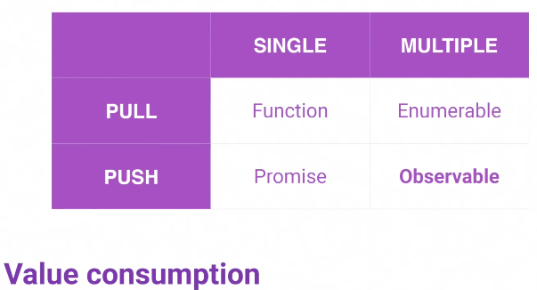

# My Notes

[Background Reading: Out of the Tar Pit, Moseley & Marks](./MoseleyMarks06a.pdf)

If you want to change the quality of code than an engineer is writing, first of all, you don't change the way that they code, you change the way that they think. You do that by understanding programming **first principles**. 

The antidote to complexity ==> simplicity

Managing complexity is the most chalenging thing about programming

The greatest contributor to complexity is: **state**. If you fail to manage state properly, you're going to exponentially increase your code volume.

**The Iron triangle of programming:**

- Handling of state
- Code volume
- Flow of control (communication)

**Shared mutable state** is incredibly dangerous

Always ask yourself, **can I test this code?** Can I reuse it? Is it portable? 

**It is impossible to write good tests for bad code**

<center><b>***If you're committed to writing tests, then you must commit to writing testable code***</b></center>

We all know we should write tests, but why don't we? Why don't people write tests? ==> because the barrier to writing tests is too high, because the code is so bad.

### Extract to Method

Functions can become unstable because of **hidden state**. This happens when your function violates the **single responsibility principle**. Solution ==> extract to method.

We want to go from coarse-grained code to fine-grained code ==> Delegate ftw!

[58e24ec5a3d6cae927e3c2196224b3c0e40fed22](https://github.com/thomashoddinott/fem-enterprise-patterns/commit/58e24ec5a3d6cae927e3c2196224b3c0e40fed22?diff=split)

### TypeScript

TS is better at **communicating intention** than JS

It's better at telling other developers (including future You) what **we expect** when we write code

### Feature Complexity

**Four Elements** of Programming:

"this is my Master thesis on programming..."

"I realised that I was essentially doing the **same four things** over and over"

- Describing Things === Data Structures (**Nouns**)
- Performing Actions === Functions (**Verbs**)
- Making Decisions === **Conditions** 
- Repeating via Iteration === **Iterators**

### Object Modelling as Nouns

A major source of complexity stems from the fact that somebody hasn't taken the time to properly model the domain that they are in. **You have to get your data models (domain) correct.**

**An interface** is a way for us to discuss what something is. **It is a contract.**

**A class** is a blueprint for defining **objects.**

### Defining & Typing Objects

[fc1d5a415eec6a2b9d5c06c696d532c03078788b](https://github.com/thomashoddinott/fem-enterprise-patterns/commit/fc1d5a415eec6a2b9d5c06c696d532c03078788b)

### Defining State

[2c6225f40cbb766b74993f79cb8da7d47f015b18](https://github.com/thomashoddinott/fem-enterprise-patterns/commit/2c6225f40cbb766b74993f79cb8da7d47f015b18)

### Object Modelling Exercise

[c96909181121e02083721151c7283a0e4572a746](https://github.com/thomashoddinott/fem-enterprise-patterns/commit/c96909181121e02083721151c7283a0e4572a746)

### Methods as Verbs

Methods which return values **are testable**

### Adding Methods

[f403057be9ec50417cb0bc361044c39c044c5ede](https://github.com/thomashoddinott/fem-enterprise-patterns/commit/f403057be9ec50417cb0bc361044c39c044c5ede)

### Adding Methods Exercise

[941a5621344ade9e134e61b433f74eec5aa4be74](https://github.com/thomashoddinott/fem-enterprise-patterns/commit/941a5621344ade9e134e61b433f74eec5aa4be74)

### Managing Flow Control

**Decisions** and coniditions ==> 

​	`if` something true/false `then` perform some action 

### Reducers

Code _should be_ **self documenting** 

With this, more often then not, you will not need to add comments

[17e27a86fac313237bcd700cb308f99f253d9429](https://github.com/thomashoddinott/fem-enterprise-patterns/commit/17e27a86fac313237bcd700cb308f99f253d9429)

### Reducer Exercise

???

### Collections and Iterators

```js
for (let i = 0, len = clients.length; i < len; ++1) {
  console.log(clients[i])
}
```

this has no knowledge over what its iterating on

(only acceptable when you need a loop for a specific length !== array.length)

```js
clients.forEach(client => console.log(client))
```

==> **Higher Order Function** is better

It's controlling itself

Some more: `filter`, `map`, `reduce` 

### Immutability

Implementing seems like a pain, but it actually results in less work over time

Immutability means, for example, that if you're comparing big objects, all you have to do is look for a new memory pointer, instead of deep comparing new/old objects (computationally expensive)

Immutability is the antitote to _shared mutable state_ problems

Examples:

- `push()` (mutable) ==> `concat()` (immutable)
- to update an item we can use `map()` followed by `Object.assign()` (shallow copy only - there are libraries for doing deep copy)
- to delete an item we use ... :drum: ... `filter()`
- Bonus! use `Object.freeze()` makes the object immutable!

### Immutable CRUD Methods Practice

[7978c825578d0d5ea29157fab5953bee9c7ed56f](https://github.com/thomashoddinott/fem-enterprise-patterns/commit/7978c825578d0d5ea29157fab5953bee9c7ed56f)

### Immutable Store Practice

[b55483a7ce9ba1663f043eaded5a66f38cb1ac21](https://github.com/thomashoddinott/fem-enterprise-patterns/commit/b55483a7ce9ba1663f043eaded5a66f38cb1ac21)

### Four Elements of Programming Recap

We've built our own Redux.

Nouns, Verbs, Conditions, Iterators 

`Axis of Evil: hidden state, nested logic, SRP violations`

### Observable Streams

**The Fifth Element** of Programming ???

**Time** - especially when we're in an asynchronous environment

This is typically where our flow control problems come from

This happens all the time in JS

https://frontendmasters.com/courses/asynchronous-javascript/

"I have seen programmers lose their mind because they cannot work out why something is breaking, **some of the time**"

**Observable** streams handle *state management*, *flow control*, and *code volume* very well

Observables give us a powerful way to **encapsulate**, **transport** and **transform** data from user interactions to create powerful and immersive experiences

It's easier to talk about observables in the context of the DOM

Observables create a tunnel for an event to travel from its origin to its destination safely

When your data hits the end of the stream, it should be in the shape you need it to be. If you need to do a lot of manipulation on it, that's an anti-pattern.

### Streaming Values Over Time

Observables are the combination of the **Iterator Pattern** and the **Observer Pattern**

==> Communicate state over time

You should be familiar with `Promises`. They are an asynchronous resolution of a value. Once it's resolved, that's all it will ever be.

Observable emit new values over time as new data is available.

e.g. a real-time score board



**But observables are hard!!!** 

Yes, they are challenging. But where people get into trouble is confusing Observables and RXJS

Traditionally, we think of programming as: `input ==> output`

"If I need something, I ask for it, and eventually I'll get it"

Now, flip the paradigm: `output ==> input`

`initial output ==> (magic) ==> final input`

DOM events are streams

`event ==> (operators) ==> subscribe`

e.g.

```typescript
export class BasicSequenceComponent implements OnInit {
  @ViewChild('btn') btn;
  message: string;
  
  ngOnInit() {
    fromEvent(this.getNativeElement(this.btn), 'click')
    	.subscribe(result => this.message = 'Beast Mode Activated!')
  }
  
  getNativeElement(element) {
    return element._elementRef.nativeElement;
  }
}
```

For observable streams, ask:

**Where is the initial output?**

```typescript
fromEvent(this.getNativeElement(this.btn), 'click')
```

**Where is the final input?**

```typescript
.subscribe(result => this.message = 'Beast Mode Activated!')
```

**What is happening in between?**

### Observables Demonstration

[64c73a24165763a62acb870c762246f74fbfdf4c](https://github.com/thomashoddinott/fem-enterprise-patterns/commit/64c73a24165763a62acb870c762246f74fbfdf4c)

### Observables Exercise

[cabbe67f8fd30276641deaee26998b8d56223bc7](https://frontendmasters.com/courses/enterprise-patterns/observables-q-a/)

### Preserving State & Merging Streams

How do we **preserve state** in a stream?

What if we have **more than one** stream? 

What can we **put** in a stream? 

In JS we can defined **partial functions** which are called when final parameters are set. Similar to **currying**, but different.

### Mapping to Functions

[map-to-functions.component.ts](apps/macro/src/app/concepts/03-map-to-functions/map-to-functions.component.ts)

### Sequencing Streams with switchMap

[triggers.component.ts](apps/macro/src/app/concepts/04-triggers/triggers.component.ts)

### Communication with Subjects

[event-communication.component.ts](apps/macro/src/app/concepts/08-event-communication/event-communication.component.ts)

Look at the examples in the code

https://stackblitz.com/edit/partial-application

### Simulating User Actions

**Distributed Complexity**

The 1st advent of JS = when jQuery showed up

Interactions knew about logic and vice-versa. Very tightly coupled. Mixed declarative markup with imperative logic :x:

Then came AngularJS, which allowed the separation of imperative logic and declarative logic :heavy_check_mark:

But, as applications grow in size, how do we share logic? ==> services

Then Redux allowed us to separate state management into reducers and stores. 

==> Complexity moving further away from the component layer.

**Manual Dispatch**

(Didn't get - should rewatch)

### Dynamic Actions & Real World Benefits

(Didn't get - should rewatch)

### Wrapping Up

---

# Enteprise Patterns Course

This is the sample project for the Enteprise Patterns course for Frontend Masters.

## Prerequisites

- [Git](https://git-scm.com/book/en/v2/Getting-Started-Installing-Git)
- Node.js and NPM – we recommend using [NVM (Linux/Mac)](https://github.com/creationix/nvm) or [NVM-Windows (Windows)](https://github.com/coreybutler/nvm-windows)
- Install Angular CLI via `npm i -g @angular/cli`

## Web: Getting Started

```
git clone https://github.com/onehungrymind/fem-enterprise-patterns.git
cd fem-enterprise-patterns
yarn
```

You can run the **micro** app via `npm run serve:micro`

The micro application will open to [http://localhost:4400](http://localhost:4400) in your browser.

You can run the **meso** app via `npm run serve:meso`

The meso application will open to [http://localhost:4500](http://localhost:4500) in your browser.

You can run the **macro** app via `npm run serve:all`

The micro application will open to [http://localhost:4200](http://localhost:4200) in your browser.

The `serve:all` command is a convenience methods that runs the `serve:api` and `serve:macro` commands concurrently. You can run each command separately if you need to.

```
"serve:api": "nx run api:serve",
"serve:micro": "nx run micro:serve --port=4400 --open",
"serve:meso": "nx run meso:serve --port=4500 --open",
"serve:macro": "ng serve --open",
"serve:all": "concurrently \"npm run serve:api\" \"npm run serve:macro\"",
```

> Note: the above terminal commands are for Mac. Remember to substitute the appropriate commands for your OS.

## Challenges

If you want to follow along with the challenges, you can check out the `start` branch to see the code without solutions. 

```
git checkout start
```
